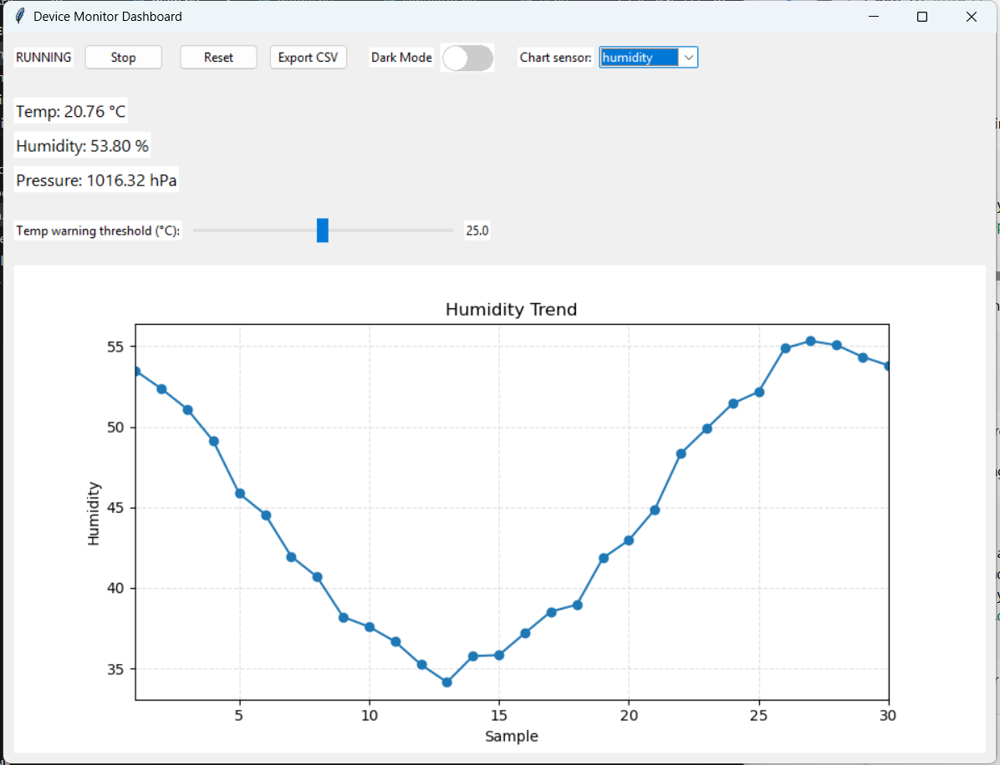

# Device Monitor Dashboard

A Tkinter-based desktop dashboard that simulates IoT sensor data and visualizes it in real time.

---

# Dashboard Preview

---

# Technology Choice

**Language:** Python 3  
**GUI Framework:** Tkinter  
**Charting Library:** Matplotlib  

Python was chosen because it allows fast prototyping and clean code organization. Tkinter is a lightweight GUI toolkit that comes bundled with Python, making it easy to build desktop interfaces without additional dependencies. Matplotlib integrates well with Tkinter and provides powerful visualization capabilities for displaying sensor trends.

---

# Application Overview

The **Device Monitor Dashboard** is a desktop application that simulates device sensor data and displays it in a graphical user interface.

The application monitors three simulated sensors:

- Temperature (°C)
- Humidity (%)
- Pressure (hPa)

Sensor values are generated internally using mathematical functions and random noise to simulate real-world sensor behavior. The values update automatically every **1 second** and are visualized using a live updating chart.

---

# Features

- Real-time simulated sensor data
- Live updating chart showing recent sensor values
- Start / Stop simulation control
- Reset button to clear sensor history
- Warning indicator when sensor values exceed threshold
- Adjustable temperature threshold slider
- Dropdown menu to select which sensor to display in the chart
- Export sensor data to CSV file
- Dark Mode toggle switch
- Clean separation between UI and data logic

---

# Bonus Features Implemented

The following optional enhancements were implemented to improve usability and software quality.

### CSV Export
Users can export historical sensor data to a CSV file using the **Export CSV** button.

### Dark Mode Toggle
A custom toggle switch allows users to switch between light and dark UI themes.

### Unit Tests
Basic unit tests were added for the data/logic layer using Python's built-in `unittest` framework.

---

# Project Architecture

device-monitor-dashboard
│
├── README.md
├── assets
│   └── dashboard.png
│
├── src
│   ├── main.py
│   ├── simulator.py
│   ├── model.py
│   └── ui.py
│
└── tests
    └── test_model.py

---

# Architecture Diagram

                   +----------------------+
                   |   SensorSimulator    |
                   |    simulator.py      |
                   |----------------------|
                   | Generates simulated  |
                   | sensor readings      |
                   +----------+-----------+
                              |
                              v
                   +----------------------+
                   |      DeviceModel     |
                   |       model.py       |
                   |----------------------|
                   | Stores sensor data   |
                   | Maintains history    |
                   | Applies thresholds   |
                   | Prepares export data |
                   +----------+-----------+
                              |
                              v
                   +----------------------+
                   |     DashboardUI      |
                   |        ui.py         |
                   |----------------------|
                   | Tkinter GUI          |
                   | Chart visualization  |
                   | Dark mode toggle     |
                   | CSV export           |
                   +----------+-----------+
                              |
                              v
                        +-----------+
                        |   User    |
                        +-----------+
                              ^
                              |
                              |
                     +----------------+
                     |     main.py    |
                     | Application    |
                     | Entry Point    |
                     +----------------+

# Data Flow Explanation

SensorSimulator → DeviceModel → DashboardUI → User
                         ↑
                         │
                    User Controls
              (Start / Stop / Reset / Toggle)

# Module Responsibilities

**main.py**  
Entry point of the application. Initializes the GUI and starts the Tkinter event loop.

**simulator.py**  
Generates simulated sensor values using sine functions and random noise.

**model.py**  
Handles application logic and data management:
- stores latest sensor readings
- maintains history buffers
- evaluates warning thresholds

**ui.py**  
Implements the graphical user interface:
- displays sensor values
- handles user interaction
- updates the chart
- exports sensor data to CSV
- supports dark mode toggle
- communicates with the model

---

# Design Patterns Used

## MVC (Model–View–Controller)

**Model:** `model.py`  
Handles application data and business logic.

**View:** `ui.py`  
Displays the user interface and charts.

**Controller:** `main.py`  
Initializes and connects the model and UI.

---

# Architecture Diagram

SensorSimulator → DeviceModel → DashboardUI → Tkinter GUI

---

# Running the Application

### Install dependencies

pip install matplotlib

### Run the application

python src/main.py

---

# Running Unit Tests

python -m unittest discover tests

---

# Author

Pratikshaba Jadeja  
Master's Student — Computer Engineering  
Arizona State University
